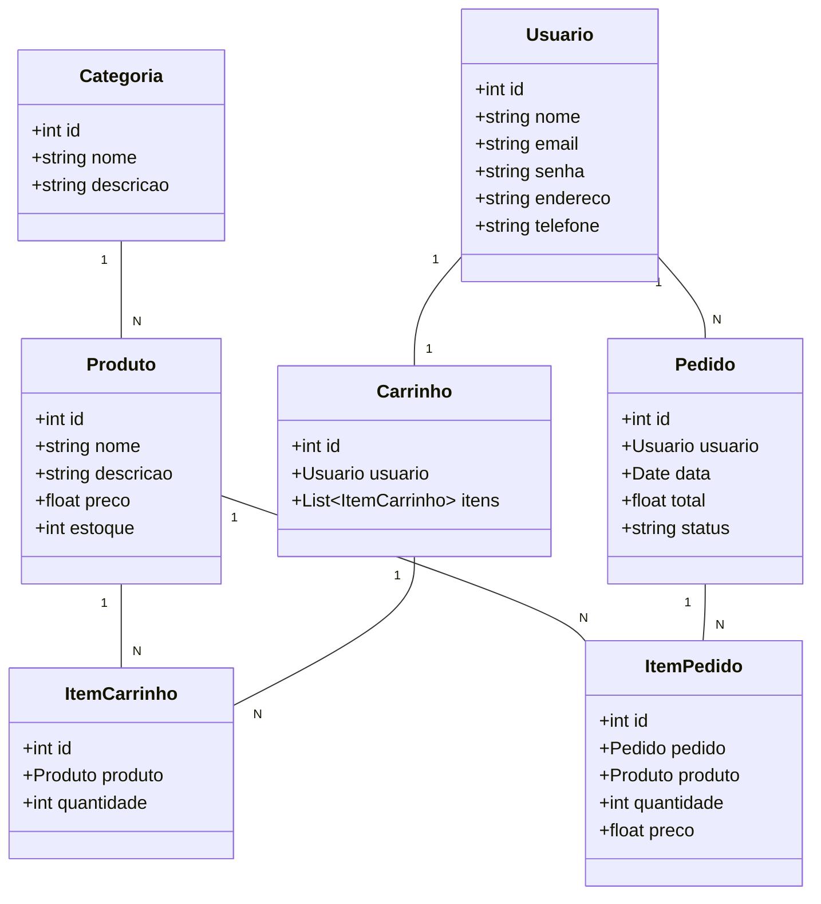
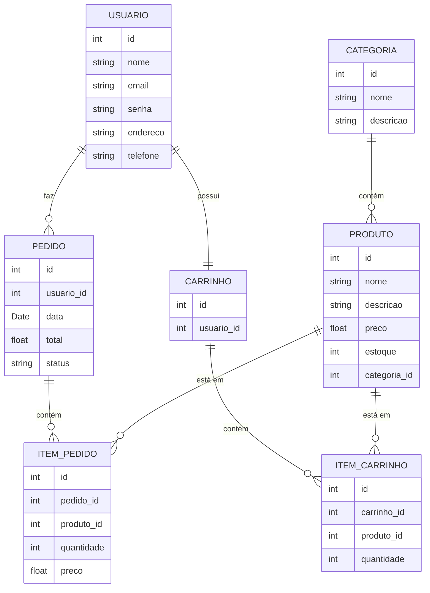

# Ecommerce

## Enunciado: Desenvolvimento de um E-commerce Didático

Neste projeto, será desenvolvido um sistema de e-commerce didático dividido em duas partes: uma versão web utilizando o **Laravel** e uma versão simplificada para dispositivos móveis usando **React Native**. O objetivo é criar uma plataforma de vendas online que permite a visualização de produtos, gerenciamento de carrinho de compras, e o processamento de pedidos, sem a necessidade de uma integração real com gateways de pagamento.

### Funcionalidades principais:

1. **Catálogo de Produtos**:
   - Os usuários poderão visualizar uma lista de produtos com informações detalhadas, como nome, descrição, preço e estoque disponível. Cada produto será vinculado a uma categoria específica.

2. **Gerenciamento de Categorias**:
   - O sistema permitirá a criação, edição e exclusão de categorias de produtos, ajudando na organização do catálogo.

3. **Usuários e Autenticação**:
   - O sistema contará com um módulo de cadastro e login de usuários. Cada usuário poderá visualizar seus dados, editar informações de contato e endereço, além de acompanhar o histórico de pedidos.

4. **Carrinho de Compras**:
   - Os usuários poderão adicionar produtos ao carrinho, ajustar a quantidade e remover itens conforme necessário. O carrinho será persistido por usuário e estará disponível para ser visualizado a qualquer momento.

5. **Pedidos**:
   - Uma vez que o usuário finalize o processo de compra, será gerado um pedido. Os pedidos conterão informações sobre o total de compra, produtos adquiridos e o status do pedido (ex: aguardando processamento, enviado).

6. **Interface Web (Laravel)**:
   - A versão web permitirá o gerenciamento completo da plataforma, desde a exibição dos produtos até o processo de finalização de pedido. Administradores poderão criar, editar e remover produtos e categorias.

7. **Interface Mobile (React Native)**:
   - A versão mobile será simplificada, oferecendo ao usuário funcionalidades como navegação pelo catálogo de produtos, gerenciamento do carrinho e finalização de pedidos.

### Estrutura de Dados

O sistema será baseado em um conjunto de entidades principais: **Usuário**, **Produto**, **Categoria**, **Carrinho**, **Pedido** e suas respectivas associações. Os relacionamentos entre essas entidades foram modelados para garantir a integridade dos dados e a consistência nas operações de compra.

- Cada **Usuário** terá um **Carrinho** e poderá fazer vários **Pedidos**.
- Cada **Produto** será vinculado a uma **Categoria**.
- O **Carrinho** conterá múltiplos itens (produtos), e um **Pedido** será gerado a partir dos itens selecionados no carrinho.

### Objetivo Educacional

Este e-commerce foi projetado com fins didáticos, focado em introduzir conceitos de desenvolvimento web e mobile, incluindo:
- **Manipulação de bancos de dados relacionais**.
- **Gerenciamento de estado em aplicações React Native**.
- **MVC (Model-View-Controller)** no Laravel.
- **Autenticação de usuários** e **CRUD** de dados (produtos, categorias, pedidos).
- **Integração entre diferentes plataformas** (web e mobile) utilizando uma API RESTful.

Este projeto, embora não contenha a complexidade de um sistema de pagamento real, oferece uma experiência prática no desenvolvimento de um sistema e-commerce básico, abrangendo o ciclo completo de navegação, seleção de produtos e processamento de pedidos.

## Diagrama de Classes



## Diagrama de Entidade Relacionamento



## Estrutura dos arquivos

### Versão Web
```
web/
│
├── app/
│   ├── Http/
│   │   ├── Controllers/
│   │   │   └── ProdutoController.php
│   │   │   └── CategoriaController.php
│   │   │   └── CarrinhoController.php
│   │   │   └── PedidoController.php
│   │   │   └── UsuarioController.php
│   │
│   ├── Models/
│   │   └── Produto.php
│   │   └── Categoria.php
│   │   └── Carrinho.php
│   │   └── Pedido.php
│   │   └── ItemPedido.php
│   │   └── Usuario.php
│
├── database/
│   ├── migrations/
│   └── seeders/
│
├── resources/
│   ├── views/
│   │   └── produtos/
│   │   └── carrinho/
│   │   └── pedidos/
│
├── routes/
│   └── web.php
│
└── public/
    └── css/
    └── js/
```


### Versão Mobile
```
mobile/
│
├── src/
│   ├── components/
│   │   └── Produto.js
│   │   └── Carrinho.js
│   │   └── Pedido.js
│   │   └── Categoria.js
│   │
│   ├── screens/
│   │   └── HomeScreen.js
│   │   └── ProdutoScreen.js
│   │   └── CarrinhoScreen.js
│   │   └── PedidoScreen.js
│   │
│   ├── navigation/
│   │   └── AppNavigator.js
│   │
│   ├── services/
│   │   └── api.js
│   │   └── auth.js
│
└── App.js
```
